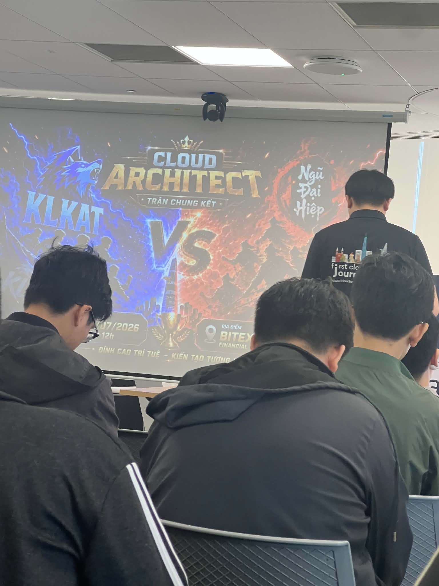

# Bài thu hoạch Workshop AWS

### Mục Đích Của Sự Kiện

- Chia sẻ kiến thức thực tế về vận hành và bảo mật hệ thống trên AWS.
- Giới thiệu lộ trình ôn thi AWS Certified Cloud Practitioner.
- Nâng cao tư duy về SLA, Monitoring và trải nghiệm người dùng.
- Tìm hiểu các công cụ AI hỗ trợ tự động hóa bảo mật ứng dụng.

### Danh Sách Diễn Giả

- **Ngô Lê Tấn Huy** – Presenter AWS Cloud Practitioner
- **Nguyễn Huỳnh Sơn** – Infrastructure Support Engineer
- **Nguyễn Tuấn Thịnh** – DevOps/DevSecOps/Cloud Engineer

---

## Nội Dung Nổi Bật

### AWS Cloud Practitioner

- Tổng quan về chứng chỉ **AWS Certified Cloud Practitioner (CLF-C02)**.
- Cấu trúc đề thi gồm 4 Domain:
  - Cloud Concepts
  - Security & Compliance
  - Cloud Technology & Services
  - Billing, Pricing & Support
- Giới thiệu mô hình **Shared Responsibility Model**.
- Ôn tập các dịch vụ quan trọng như:
  - EC2
  - S3
  - IAM
  - VPC
  - Lambda
  - RDS
- Chia sẻ kinh nghiệm ôn thi:
  - Học theo từ khóa (Keyword Mapping)
  - Thực hành AWS Free Tier
  - Làm đề và phân tích đáp án sai.

### SLA và Monitoring

- Giải thích khái niệm **Service Level Agreement (SLA)**.
- Vai trò của Monitoring trong quản lý rủi ro.
- Hiểu sự khác biệt giữa:
  - Hệ thống hoạt động bình thường.
  - Người dùng thực sự sử dụng được hệ thống.
- Giới thiệu **Monitoring Pyramid**:
  - Cloud Provider
  - Infrastructure
  - Application
  - Business Metrics
  - Customer Experience
- Demo sử dụng:
  - CloudWatch
  - CloudWatch Alarm
  - SNS
- Nhấn mạnh việc theo dõi các chỉ số nghiệp vụ như:
  - Login Success Rate
  - Checkout Success
  - Payment Success

### AWS Security Agent

- Những hạn chế của kiểm thử bảo mật truyền thống:
  - Tốn thời gian
  - Chi phí cao
  - Khó mở rộng
- Giới thiệu **AWS Security Agent** sử dụng AI.
- Các chức năng chính:
  - Design Security Review
  - Code Security Review
  - Automated Penetration Testing
- Tích hợp trực tiếp với GitHub/GitLab.
- Tự động phát hiện lỗ hổng và đề xuất bản vá.
- Hỗ trợ kiểm tra kiến trúc theo các tiêu chuẩn:
  - AWS Well-Architected
  - PCI DSS
  - NIST

---

## Những Gì Học Được

### Kiến Thức AWS

- Hiểu rõ cấu trúc kỳ thi AWS Cloud Practitioner.
- Nắm được các dịch vụ AWS cơ bản và trường hợp sử dụng.
- Hiểu mô hình Shared Responsibility giữa AWS và khách hàng.
- Biết cách lựa chọn mô hình tính phí và quản lý chi phí AWS.

### Monitoring & Reliability

- Monitoring không chỉ theo dõi CPU hay Memory.
- Cần theo dõi cả trải nghiệm người dùng và chỉ số nghiệp vụ.
- Biết cách xây dựng Dashboard, Alarm và Notification bằng CloudWatch.

### Security

- Hiểu quy trình bảo mật từ thiết kế đến triển khai.
- Biết cách sử dụng AI để hỗ trợ kiểm tra bảo mật ứng dụng.
- Hiểu vai trò của Security Review và Pentesting trong DevSecOps.

---

## Ứng Dụng Vào Công Việc

- Chuẩn bị lộ trình học và thi chứng chỉ AWS Cloud Practitioner.
- Áp dụng CloudWatch và SNS để giám sát hệ thống.
- Theo dõi các Business Metrics thay vì chỉ theo dõi hạ tầng.
- Áp dụng Security Review ngay từ giai đoạn thiết kế hệ thống.
- Tích hợp AI hỗ trợ kiểm tra bảo mật trong quy trình phát triển phần mềm.

---

## Trải Nghiệm Trong Workshop

Tham gia chuỗi workshop AWS giúp tôi có thêm nhiều kiến thức thực tế về vận hành, bảo mật và quản lý hệ thống trên nền tảng AWS.

### Học hỏi từ các chuyên gia

- Các diễn giả chia sẻ nhiều kinh nghiệm triển khai AWS trong doanh nghiệp.
- Được tiếp cận các ví dụ thực tế về vận hành và bảo mật hệ thống.

### Trải nghiệm kiến thức thực tế

- Hiểu rõ hơn cách AWS phân chia trách nhiệm bảo mật.
- Trực tiếp quan sát demo Monitoring bằng CloudWatch và SNS.
- Hiểu cách xây dựng Dashboard theo góc nhìn của người dùng thay vì chỉ theo dõi hạ tầng.

### Tìm hiểu công cụ hiện đại

- Biết thêm về AWS Security Agent sử dụng AI để hỗ trợ Security Review và Pentesting.
- Hiểu khả năng tự động phát hiện lỗ hổng và hỗ trợ vá lỗi trong quy trình DevSecOps.

### Bài học rút ra

- Hệ thống hoạt động tốt chưa chắc người dùng có trải nghiệm tốt.
- Monitoring cần tập trung vào Business Metrics và Customer Experience.
- Security nên được tích hợp ngay từ giai đoạn thiết kế và phát triển.
- Việc học AWS nên kết hợp giữa lý thuyết, thực hành và làm bài thi thử để đạt hiệu quả cao.

---

## Một số hình ảnh khi tham gia sự kiện

------------------------------------------------------------------------------------------------------------------------------------------

> Tổng kết lại, chuỗi workshop giúp tôi hiểu rõ hơn về kiến trúc AWS, vận hành hệ thống, giám sát dịch vụ và bảo mật ứng dụng. Những kiến thức này không chỉ hữu ích cho việc chuẩn bị chứng chỉ AWS Cloud Practitioner mà còn có thể áp dụng trực tiếp trong các dự án thực tế và công việc sau này.